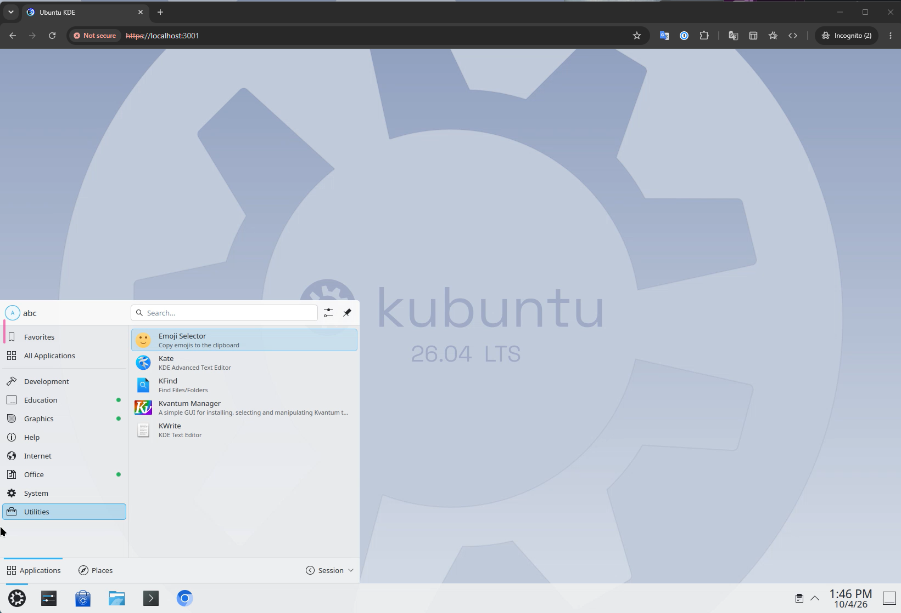
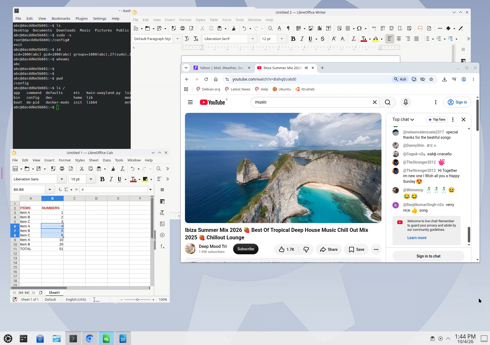

# Persistent Desktops for WSLC

PDWSLC is an independent community project for persistent Linux desktops on
Windows. The PowerShell manager and native Windows app preview run desktops using
`wslc.exe` and [LinuxServer Webtop](https://docs.linuxserver.io/images/docker-webtop/).
The desktop opens in your Windows browser and can be used full screen.

Author: **Sebastian Sejzer**.

## Screenshots

KDE desktop running in the Windows browser:



Linux applications running inside the desktop, including a terminal, LibreOffice,
and Chromium:



## Project status

The current launcher creates or reuses a desktop, preserves its home volume,
lists desktops and storage, starts and stops desktops, supports explicit deletion,
reports status and logs, and waits for local HTTPS before
opening the browser. It also accepts a custom image, name, session, port, and
timezone. Its default timezone is `Asia/Jerusalem`; override it with `-TimeZone`.

Verified on Windows with WSLC 3.0.1: KDE startup, HTTPS response, repeated starts,
and stop/resume with a home file preserved. Persistence across Windows reboot
and WSLC session recreation has not yet been validated.

The native Windows app preview provides desktop and storage lists, creation,
Start/Stop/Open/Logs actions, and explicit deletion options using the same
PowerShell manager. It uses WPF and .NET 10, with the Windows browser displaying
the desktop.

Desktop catalogs, an installation wizard, managed updates, GPU configuration,
xrdp, and release packaging remain planned in the
[roadmap](docs/ROADMAP.md). See the [architecture](docs/ARCHITECTURE.md) for
the proposed design and [contributing guide](CONTRIBUTING.md) for validation.

## Requirements

- **WSL 3.0.1 or later**, with `wslc.exe` available on PATH.
- Windows PowerShell 5.1 or newer, and Windows `curl.exe`.
- Internet access for the first image download.

PDWSLC requires WSL 3.0.1 or later. The launcher checks the installed WSL
version before accessing desktop containers. Check it with `wsl --version`
and update with `wsl --update` if needed.
See the [WSL Containers documentation](https://learn.microsoft.com/en-us/windows/wsl/wsl-container)
for installation and version checks.

## Startup pre-flight and automatic setup

Before desktop discovery, the native app checks Windows support, Windows
PowerShell, curl, CPU virtualization when detectable, Virtual Machine Platform,
WSL 3.0.1+, and the WSLC executable. .NET is already included in the portable
executable; no .NET runtime installer runs. The .NET SDK is needed only to build
from source.

If WSL or its Windows components are missing, the app automatically starts an
elevated helper to enable Virtual Machine Platform and run
`wsl --install --no-distribution --web-download`. If WSL is older than the
project minimum or WSLC is missing, it runs `wsl --update --web-download`.
These are [Microsoft's WSL installation/update commands](https://learn.microsoft.com/en-us/windows/wsl/basic-commands).
The helper installs no Linux distribution, runs no shutdown/unregister command,
and never deletes desktop containers or home volumes.

Windows may show its administrator consent prompt. Installation progress appears
in the setup console; the app reports the outcome and verifies prerequisites
again before discovery. If Windows reports a restart requirement, the app stops
setup and remembers it until a reboot is detected. It does not reboot the PC.
Reopen the app after restarting to finish any remaining setup.

Declining elevation or an installation failure leaves desktop actions unavailable.
Setup runs at most once per launch; right-click **Host > Check requirements**
to explicitly retry. Unsupported Windows versions, missing/disabled system
PowerShell or curl, and disabled firmware/nested virtualization produce actionable
messages. Those OS/firmware problems require Windows maintenance rather than a
separate downloaded runtime installer. Software downloads require internet access
and may be blocked by organizational policy.

The healthy-host pre-flight is checked on Windows. Missing/old WSL, feature
installation, consent rejection, and restart handling are covered by simulated
tests; a full clean-Windows install/reboot cycle remains unvalidated. The script
CLI retains its existing prerequisite errors and does not automatically elevate.

## Native Windows app preview

A single-file portable x64 executable is available locally after publishing at
`artifacts/app/win-x64/PDWSLC.exe`. Run it directly from Windows PowerShell:

```powershell
& .\artifacts\app\win-x64\PDWSLC.exe
```

Or use `.\windows-app.cmd`. Calling the executable directly avoids CMD's UNC
working-directory warning when the repository is under `\\wsl.localhost`.
Copy **only `PDWSLC.exe`** to another folder or Windows PC. The executable
bundles .NET, native libraries, and its PowerShell scripts; no companion DLLs,
`runtime` folder, installer, or separate .NET installation is needed. Old
companion files from earlier folder-based builds are no longer used.

At launch, .NET unpacks native components into its extraction cache and the app
unpacks its bundled scripts into `%LOCALAPPDATA%\PDWSLC\runtime\<content-version>`.
The executable's folder can be read-only. Desktop containers and home volumes
still live in the destination PC's WSLC session; copying the app does not copy
them. Folder organization remains under `%LOCALAPPDATA%\PDWSLC`, so this is a
portable executable rather than a zero-write or settings-on-USB mode.
Build output is ignored by Git.

To build from source, install the [.NET 10 SDK](https://dotnet.microsoft.com/download/dotnet/10.0)
and run:

```powershell
powershell.exe -NoProfile -ExecutionPolicy Bypass -File .\build-app.ps1
# For Windows on ARM:
powershell.exe -NoProfile -ExecutionPolicy Bypass -File .\build-app.ps1 -Runtime win-arm64
```

The app checks the same WSL/WSLC and PowerShell prerequisites as the script
and automatically sets up missing WSL components as described above.
The Explorer-style tree has a permanent root named **Host**. Right-click Host
or a subfolder to create desktops, create subfolders, or refresh. Subfolders
can be renamed or removed; removing one moves its contents to its parent and
never deletes runtime resources. Host cannot be renamed or deleted.

Right-click a desktop for Open, Start, Stop, Move to folder, Delete, and
**Properties** (the final menu option). Properties displays current state,
image, storage, management, creation time, last start/stop times, and the last
100 log lines. **Open** is the default desktop action: double-click the desktop
or select it and press Enter. It is shown in bold in the right-click menu.
Timestamps come from WSLC; unset timestamps show "Not recorded".
These are the latest runtime timestamps rather than a complete action history.

Attached home storage appears as a child of each desktop that references it.
Its Properties menu shows volume details. It moves with its desktop; independent
move/delete actions are available only once storage is orphaned.

Move desktops and orphaned home volumes using their Move to folder menu or by
dragging them onto a folder. Folder placement is saved per WSLC session in
`%LOCALAPPDATA%\PDWSLC\folders.json`; it changes organization only, without
renaming containers, moving home data, or changing mounts. A desktop's home
volume follows its folder, so retained storage appears in the last used folder
when the desktop disappears. Orphans discovered without saved placement appear
under Host. A desktop recreated from moved orphan storage inherits that folder.
Orphans remain visible when the running-desktops filter is enabled.

Changing sessions clears the previous runtime view; right-click Host and refresh
before acting. New desktop opens a form for KDE, experimental Xfce, or custom
Webtop-compatible images. Use distinct names and ports for separate desktops.
Open waits for readiness before opening the Windows browser. Stop retains the
container and home. Delete opens a task window: home storage is kept by default,
and removing it requires its explicit checkbox. Unlabelled legacy storage also
requires its authorization checkbox. Orphaned storage has its own Delete action.
The same script ownership and shared-volume checks apply.

Operations run asynchronously with output shown in the window. Controls are
locked until the operation finishes, and closing the window during an operation
is deferred to avoid interrupting a mutation. Discovery and logs have a
60-second timeout; image downloads may take several minutes. The app does not
stop containers when you close it. Refresh reads runtime state; the saved file
contains folder organization only. Invalid folder files are retained and reported
rather than overwritten.

This is a preview. Core and simulated lifecycle tests cover process arguments,
JSON, storage safeguards, folder persistence, moves, and orphan placement.
Native UI smoke checks cover read-only discovery, context menus, folder editing
with disposable metadata, and Properties.
Creation/deletion through the UI and end-to-end browser interaction still need
validation on dedicated desktop resources. Reboot/session storage durability,
installers, backups, profile migration, and concurrent management from multiple
app instances remain outside this preview.

## Run

From this directory in Windows PowerShell:

```powershell
.\desktop.ps1
```

If PowerShell reports that running scripts is disabled, use a policy override
for just the launcher process:

```powershell
powershell.exe -NoProfile -ExecutionPolicy Bypass -File .\desktop.ps1
```

The launcher reuses a container named `desktop`, including its existing image,
home mounts and HTTPS port. If it is stopped, the launcher starts it. If it does
not exist, the launcher creates it with the `ubuntu-kde` Webtop image, a
`desktop-home` named volume mounted at `/config`, 1 GiB of shared memory, and
HTTPS port 3001 bound to Windows loopback. It waits for an HTTP response before
opening `https://localhost:3001`. Accept Webtop's self-signed certificate in the
browser for this local address.

If `desktop-home` already exists, the launcher reuses it and retains its data.

You can also use `desktop-manager.cmd`, which applies the process-only PowerShell policy
override and forwards the same arguments. It works from the WSL network path:

```powershell
.\desktop-manager.cmd -Action List
.\desktop-manager.cmd -Action List -Running
.\desktop-manager.cmd -Action Storage
.\desktop-manager.cmd -Action Start -Name desktop
.\desktop-manager.cmd -Action Open -Name desktop
.\desktop-manager.cmd -Action Stop -Name desktop
```

`List` reports name, state, image, URL, home storage, and management status in
the selected WSLC session. New containers and home volumes receive PDWSLC
ownership labels. Older Webtop containers with the expected `<name>-home`
volume at `/config` appear as `Legacy`. Unrelated containers are excluded.
`Storage` includes owned home volumes and unlabelled `-home` candidates, showing
container references and whether a volume is orphaned; a name alone does not
prove ownership. All commands accept `-Session`. `List`, `Storage`, and `Status` also accept
`-Json` for machine-readable output; lists always return a JSON array.

Explicit `-Action Start` starts or creates the desktop and waits for readiness
without opening a browser. `Open` also opens the browser. Running the launcher
without an action retains its original start-and-open behavior. `-NoBrowser`
suppresses browser opening.

Deletion requires an explicit name and does not ask for confirmation:

```powershell
.\desktop-manager.cmd -Action Delete -Name desktop                 # Keep home storage
.\desktop-manager.cmd -Action Delete -Name desktop -IncludeStorage # Delete owned home storage too
```

Deletion stops a running desktop before removing its container. Container
removal deletes software installed in its writable layer. `-IncludeStorage`
also permanently deletes home files and settings. Storage deletion checks
ownership and refuses volumes referenced by another container before removing
anything. It can also remove an owned orphan home volume when the container
is already absent. If volume removal fails after container removal, the error
reports that storage remains.

Volumes created by the older launcher have no ownership labels. To explicitly
authorize deleting an unlabelled legacy `<name>-home` volume, add `-Adopt`:

```powershell
.\desktop-manager.cmd -Action Delete -Name desktop -IncludeStorage -Adopt
```

Here `-Adopt` authorizes this deletion only; it does not relabel storage. Volumes
with other ownership labels and volumes shared with another container are retained.

An existing container must publish Webtop's HTTPS port, `3001/tcp`, to an IPv4
loopback or wildcard host address. An incompatible container is retained and
reported rather than replaced.

```powershell
.\desktop.ps1 -Action Status
.\desktop.ps1 -Action Logs
.\desktop.ps1 -Action Stop
.\desktop.ps1                     # Resume and reopen
.\desktop.ps1 -NoBrowser          # Start and print the URL
.\desktop.ps1 -Session <session>  # Use the session containing your desktop
```

For a new container, customize its name, image, port or timezone:

```powershell
.\desktop.ps1 -Name xfce -Image lscr.io/linuxserver/webtop:ubuntu-xfce -Port 3002
```

Creation options apply only when the named container is absent. Startup waits
up to 300 seconds after creation; use `-TimeoutSeconds` to adjust this. A failed
startup leaves the container and volume available for inspection. The initial
image download happens before this readiness timeout.

## Persistence and lifecycle

The desktop user's home, documents and settings live in `/config`. Stopping the
container or closing the browser keeps those files. Closing the browser leaves
the container running. System package changes belong to the container's writable
layer; bake them into a custom image to retain them across container replacement.
Stopping and starting never remove containers or volumes. Only explicit `Delete`
removes containers, and storage removal additionally requires `-IncludeStorage`.
The launcher does not upgrade existing images.

The launcher uses Webtop's browser streaming and does not require xrdp or WSLg
desktop support. GPU acceleration is not configured. For the image's desktop
variants and streaming options, see the upstream Webtop documentation.

PDWSLC code is licensed under the [MIT License](LICENSE). Desktop images and
their bundled applications retain their respective upstream licenses.
