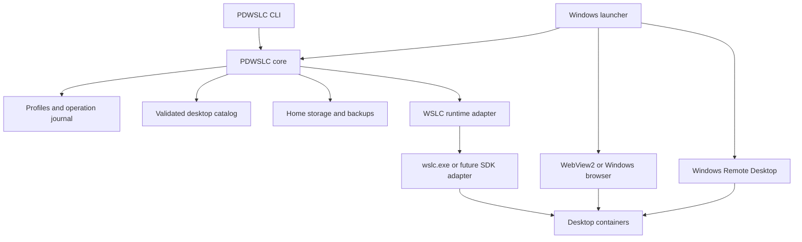

# PDWSLC architecture and proposed extensions

The Windows launcher manages installations and connections; WSLC executes
containers, and desktop images supply Linux graphical services. Keep those
responsibilities separate so browser and RDP desktops share installation,
storage, and recovery logic.

The implemented preview uses WPF on .NET 10 in `src/PDWSLC.App` and a small
process adapter in `src/PDWSLC.Core`. The adapter invokes a bundled UTF-8
PowerShell bridge with argument arrays and reads JSON for discovery. Single-file
publishing bundles .NET/native dependencies; PowerShell scripts are embedded
resources extracted into a content-versioned user cache and checked against the
embedded bytes before reuse. Nothing must be installed beside the executable. Lifecycle
and storage policy remains in `desktop.ps1`; both native and command-line
interfaces use it. The UI serializes its operations, exposes progress/errors,
and refreshes runtime state after mutations. `FolderStore` atomically saves a
versioned tree and desktop/home placements per session under the user's local
app data. This organizational metadata is separate from container configuration
and retains orphan placements. Host is protected in both the UI and store.
Properties reads runtime timestamps and logs. A requirements coordinator gates
startup discovery: an embedded read-only PowerShell probe feeds a tested core
policy, and a separate elevated helper installs/updates WSL and enables missing
Windows components. Setup is attempted once, verifies the resulting state,
persists reboot requirements, and never issues container or distribution deletion
commands. The app uses its bundled .NET runtime; no runtime installer is needed.
It does not yet implement full
profile storage, operation journals, cross-process locks, or an installer.

The remaining component diagram and extended layout below are proposed.
WinUI, an SDK adapter, and embedded viewers can be evaluated later; the usable
preview intentionally uses WPF and the external Windows browser.

## Components



Implemented projects and proposed extensions:

```text
src/PDWSLC.Core/       implemented process adapter, requests, discovery models
src/PDWSLC.Wslc/       runtime adapter and capability detection
src/PDWSLC.Cli/        scriptable access to the shared core
src/PDWSLC.App/        implemented WPF manager and bundled script bridge
catalog/              versioned desktop manifests
images/               custom images, starting with Ubuntu Xfce xrdp
tests/                core tests and Windows integration scenarios
```

Add projects with their first usable implementation rather than creating empty
build scaffolding. The preview targets .NET 10 LTS; `global.json` selects a stable .NET 10 SDK.
Pin Windows App SDK and WebView2 versions if those dependencies are introduced.

## Runtime boundary

An `IDesktopRuntime` adapter provides capabilities, session discovery,
image pull/inspect, container discovery/create/start/stop/inspect, logs,
execution, and volume operations. Begin with `wslc.exe`, argument arrays,
exit-code checks, asynchronous output, and JSON parsing. Never interpolate
user input into shell commands. Detect command/schema differences across
installed runtime versions.

Require WSL 3.0.1 or later at the runtime boundary and in prerequisite checks.

The [WSL Containers SDK](https://learn.microsoft.com/en-us/windows/wsl/wsl-container)
provides programmatic session/container/process APIs. Evaluate an SDK adapter
after the CLI version works. Test durable storage, session ownership after UI
exit, and discovery of CLI-created resources before adopting it. Do not move
existing desktops into an application-owned session automatically.

The core owns timeouts, cancellation, and per-profile operation locks. A
canceled pull may retain cached layers; installation records whether storage
and container creation happened before retrying.

## Profiles and ownership

Use versioned JSON metadata separate from observed runtime state:

| Field | Purpose |
| --- | --- |
| `schemaVersion`, `id`, `name` | Migration, stable identity, display name |
| `catalogId`, `imageReference`, `imageDigest` | Selected desktop and installed image |
| `runtimeSession`, `containerId`, `containerName` | Runtime identity/discovery |
| `ownership` | Adopted or PDWSLC-created; limits cleanup scope |
| `home` | Storage driver/reference, mount path, UID/GID, backup policy |
| `transport`, `bindings` | Browser/RDP and actual host/container ports |
| `resources`, `timezone`, `gpuMode` | Creation settings and capability preferences |
| `previousGeneration`, `operationId` | Rollback/recovery references |

Store metadata under `%LOCALAPPDATA%\PDWSLC` and allow a durable data directory
for VHDs/backups. Use atomic file replacement and schema migrations. Profiles
contain secret references only; credentials belong in Windows Credential
Manager or protected per-user storage.

Inspect runtime state rather than trusting cached status. Distinguish missing
session, absent container, partial install, and failed connection. Label
PDWSLC-created resources; adopted resources remain external. Removing an
adopted profile must not delete its container or home volume as a side effect.

## Storage and updates

Home data is separate from replaceable container/image state. Verify each
storage driver and session boundary before promising reboot persistence.
Application installation directories never hold desktop homes or VHDs.

Browser desktops use `/config`, as documented by
[Webtop](https://docs.linuxserver.io/images/docker-webtop/). Custom RDP images
declare a home path. Backups preserve Unix ownership, permissions, and symlinks;
a Windows filesystem copy is not automatically an equivalent home backup.

Allow only one active writer per home. Candidate updates test against a clone;
activation and rollback use a consistent backup and durable operation journal.
Rollback restores settings as well as image configuration. Environment changes
create a new profile; import documents without sharing desktop settings.

## Lifecycle and recovery

Lifecycle states: Discovered, Installing, Stopped, Starting, Ready, Stopping,
Updating, Failed. Connection state is separate: a container can run without a
viewer, and an HTTP response can precede a working graphical session. Extend
readiness checks to the actual desktop and transport in the core implementation.

Journal prepare, download, backup, stage, validate, activate, and finalize.
After interruption, reconcile records with actual containers/volumes before
retrying. Prevent concurrent start/stop/update/backup operations on a desktop.
Report actionable distinctions between network, Linux-service, storage, and
runtime-capability failures.

## Connections and Windows UI

Separate the desktop library from its viewer. WebView2 hosts the local HTTPS
desktop; keep the Windows browser as fallback. Verify certificates per profile
and scoped local endpoint. Never globally suppress TLS errors. Scope clipboard,
microphone, and other viewer permissions to the desktop origin.

The first RDP connection launches `mstsc.exe` with a password-free `.rdp` file.
Use desktop-user authentication and Windows credential facilities. RDP and
browser sessions are distinct unless an image proves shared-session behavior.

Closing a viewer disconnects; Stop terminates the desktop cleanly. Preserve
this distinction after any change to session ownership. Test whether a tray
or runtime process is required to keep SDK-owned sessions alive.

## GPU and validation

Profiles express GPU preferences; probes report rendering, encoding, and
compute independently. Software is the fallback. GPU flags and CUDA results
do not prove desktop/stream acceleration. Test Windows/WSL device exposure
against the image's rendering and encoding libraries per vendor.

Core tests cover profile migration, resource ownership, operation recovery,
port allocation, update failures, and runtime JSON parsing. Integration tests
exercise Windows WSLC, persistent homes, viewer reconnect, RDP login, and reboot.
GPU tests need hardware; do not infer their results from ordinary build CI.

Evaluate installer packaging against data paths and process lifetime. Launcher
updates remain separate from desktop image updates. Initially reference
upstream desktop images; any later image redistribution carries its own
license notices and provenance.
